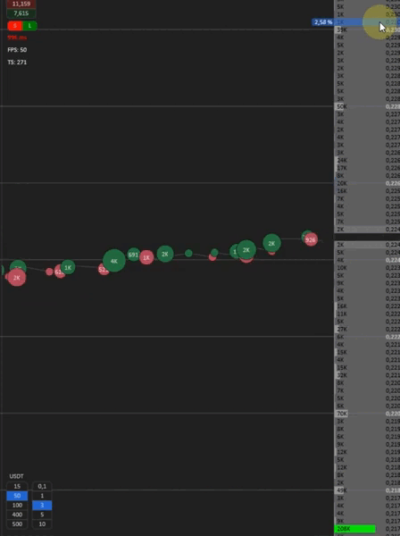

# Стаканы

Расширенные настройки стакана

Данный раздел предназначен для детальной настройки поведения и визуального отображения стакана заявок. Он позволяет гибко адаптировать работу стакана под ваш стиль торговли и особенности анализа. Настройки разбиты на вкладки:&#x20;

* **Выбор  биржи**
* **Стакан**
* **Лента**
* **Кластер**
* **Прочее**&#x20;

&#x20;

## <mark style="background-color:blue;">Выбор биржи</mark>

<figure><figcaption></figcaption></figure>

**Выбор  биржи** - в верхней части окна позволяет задавать индивидуальные настройки для каждой торговой площадки отдельно, включая разделение между спотовым и фьючерсным рынком. Это даёт возможность точно настроить отображение стакана, ленты и других модулей под особенности конкретного инструмента и типа рынка.

## <mark style="background-color:blue;">Стакан</mark>

Во вкладке **«Стакан»** доступны следующие модули:

* **Заполнение стакана по ширине** — регулирует визуальное распределение уровней стакана по горизонтали, что позволяет лучше считывать плотности.
* **Пресеты сжатия** — настройка масштабирования ценовых уровней, позволяющая уменьшать или увеличивать плотность отображения ордеров.
* **Выделение круглых чисел** — позволяет автоматически подсвечивать ключевые уровни с «круглыми» значениями, которые часто привлекают внимание участников рынка.
* **Выделение новых ордеров** — активирует визуальное выделение только что появившихся ордеров.
* **Выделение новых ордеров 2** — дополнительная логика/механика подсветки свежих изменений (настраивается отдельно от основного фильтра).

В нижней части окна доступны кнопки:

* **Применить** — сохраняет выбранные параметры для текущей биржи и интерфейсной конфигурации.
* **Исключения** — позволяет задать исключения для определённых инструментов или условий (например, отключить определённые настройки для конкретной пары).

> ⚙️ Эти настройки особенно полезны для активной торговли и помогают быстро визуально ориентироваться в изменениях внутри стакана.

### **Заполнение стакана по ширине**

#### Настройки заполнения стакана по ширине

Этот блок отвечает за визуальное заполнение строк в стакане, что помогает лучше различать крупные заявки и оценивать их влияние на текущую ситуацию.

<figure><figcaption></figcaption></figure>

**Основные параметры:**

* **Режим заполнения** —  это то, как будут заполняться лимитные заявки по ширине стакана. В ручном режиме необходимо указать сумму, при которой лимитная заявка будет занимать всю ширину стакана. В автоматическом режиме стакан сам ищет самую крупную заявку и под неё подстраивает ширину остальных заявок. В автоматическом режиме необходимо указать дистанцию в процентах, в пределах которой стакан будет искать крупную заявку.

<figure><figcaption>
в автоматический режим в данном примере будет искать самую крупную заявку в пределах 10 % от спреда и использовать её как ориентир для масштабирования ширины остальных заявок в стакане.
</figcaption></figure>

<figure><figcaption>
В ручном режиме указывается сумма лимитной заявки в выбранной валюте стакана, при которой заявка будет занимать всю ширину стакана
</figcaption></figure>

<figure><figcaption>
пример автоматического поиска с дальностью 10%
</figcaption></figure>

* **Количество крупных заявок для расчёта средней** — сколько заявок будет учитываться при расчёте средней величины, влияющей на динамику заливки.

<figure><figcaption></figcaption></figure>

* **Подстройка заполнения по ширине** — параметр, который регулирует степень масштабирования ширины визуального заполнения заявок в стакане в зависимости от их плотности.\
  Это коэффициент для более точной и гибкой настройки отображения, позволяющий оптимально адаптировать заливку под ваши предпочтения или особенности конкретного инструмента.

<figure><figcaption></figcaption></figure>

<figure><figcaption>
коэффициент 1 это 100% заполнения шкалы
</figcaption></figure>

* **Статическое заполнение ширины стакана** —заполняет заявки только при открытии стакана либо при смене инструмента. Удобно в ситуациях, когда крупные заявки часто появляются и исчезают, но при этом важно, чтобы ширина заполнения оставалась стабильной и не "прыгала" во время торговли.

<figure><figcaption></figcaption></figure>

**Подсветка крупных заявок:**

<figure><figcaption></figcaption></figure>

* **Подсвечивать крупные заявки 1 / 2** — включает два независимых уровня выделения ордеров по заданным условиям.
* **Процент от ширины заполнения для подсветки** — значение, начиная с которого заявка считается крупной и подсвечивается в интерфейсе.

<figure><figcaption></figcaption></figure>

* **Отображение крупных плотностей за полем видимости** — -- отображает по краям стакана ближайшие крупные заявки, которые находятся за пределами видимой области.

<figure><figcaption></figcaption></figure>

* **Отображать расстояние до крупных плотностей** — при включении дополнительно показывается дистанция (в процентах) до ближайшей плотности вне видимости.
* **Дальность поиска крупных заявок за пределами видимости** — позволяет задать максимальный процентный диапазон, в рамках которого система будет искать крупные заявки за границами экрана.

<figure><figcaption></figcaption></figure>

*

***


Эти настройки позволяют настроить визуальный приоритет для крупных ордеров и повысить читаемость стакана в моменты высокой активности.


### Пресеты сжатия

<figure><figcaption></figcaption></figure>

<figure><figcaption>
выбор пресета сжатия
</figcaption></figure>

Пресеты сжатия позволяют быстро изменять масштаб стакана по вертикали. Это особенно удобно для адаптации интерфейса под текущую рыночную ситуацию, уровень волатильности или личные предпочтения в восприятии информации.

Каждый пресет задаёт автоматическое **сжатие стакана по высоте**, устанавливая расстояние от спреда до края стакана в виде фиксированного процента.

**Пояснение:**

**Пресет видимости** — это параметр, определяющий, сколько процентов от текущей цены будет занимать вертикальная область стакана. Например, при значении `5%` вы будете видеть заявки, находящиеся в пределах 5% вверх и вниз от спреда.

**Доступные поля:**

* **Пресет видимости 1–5** — пользователь может задать до 5 собственных пресетов сжатия в процентах.
* **Пресет по умолчанию** — указывает, какой из пресетов будет применяться при открытии стакана или сбросе настроек.

> ⚙️ Такие пресеты позволяют быстро переключаться между компактным и расширенным видом стакана в зависимости от активности и плотности заявок.

### Выделение крупных чисел

<figure><figcaption></figcaption></figure>

Этот раздел позволяет настроить автоматическое выделение «круглых» уровней в стакане — значений цены, кратных определённому шагу. Такие уровни часто выступают в роли психологических барьеров и точек интереса для участников рынка.

**Параметры:**

* **Отображать сетку**\
  При активации включается визуальная сетка на уровне круглых чисел, а сами значения выделяются **жирным шрифтом**. Это облегчает визуальное восприятие ключевых уровней.

<figure><figcaption>
с включённой сеткой
</figcaption></figure> <figure><figcaption>
без сетки
</figcaption></figure>

*   **Минимальное количество тиков между круглыми уровнями**\
    Определяет, как часто в стакане могут встречаться круглые уровни. Это значение задаёт минимальное расстояние между ними в **тиках** — чем оно выше, тем реже будут выделяться такие уровни.

*   **Шаг круглых уровней**\
    Устанавливает конкретный шаг, с которым будут определяться и выделяться круглые значения. Может быть задан в **процентах** или **тиках** (выбор доступен в выпадающем списке).

* **Учитывать сжатие стакана**\
  При активации сетка с круглыми уровнями будет масштабироваться вместе со сжатием стакана.\
  Эта настройка применяется **только если шаг круглых уровней задан в тиках**, и позволяет сохранить пропорциональное отображение уровней даже при изменении масштаба.

<figure><figcaption>
Этот параметр становится доступным <strong>только при выборе шага круглых уровней в тиках</strong>.
</figcaption></figure>

***

### Выделение новых ордеров

<figure><figcaption></figcaption></figure>

Этот блок позволяет настраивать визуальное выделение только что появившихся заявок в стакане. Подсветка помогает быстрее реагировать на изменения в ликвидности и активности других участников рынка.

**Параметры:**

* **Выделять новые ордера**\
  Включает или отключает механизм подсветки новых лимитных заявок, появляющихся в стакане.
* **Градиентная подсветка новых ордеров**\
  При активации новые заявки подсвечиваются с помощью цветового градиента, где **яркость зависит от "свежести" заявки**. Чем новее заявка, тем интенсивнее подсветка.
* **Нижний порог яркости градиента (от 0 до 1)**\
  Минимальное значение яркости градиента для самой слабой подсветки.
* **Верхний порог яркости градиента (от 0 до 1)**\
  Максимальная интенсивность подсветки новых заявок.
* **Минимальный / Максимальный процент от ширины заполнения стакана**\
  Эти параметры позволяют ограничить выделение только тем ордерам, которые занимают определённую долю ширины визуального заполнения. Будут подсвечиваться только те заявки, размер которых **выше (или ниже) заданного процентного значения**.\
  Если в поле указано `0`, фильтр не применяется. Это позволяет отсекать слишком мелкие или, наоборот, слишком крупные ордера из подсветки.
* **Минимальная / Максимальная сумма ордера**\
  Ордер будет выделяться, если он больше указанного значения в выбранной валюте стакана. Данная настройка имеет приоритет над процентами. Если в поле указан 0, то фильтр не используется.
* **Время выделения ордеров**\
  Устанавливает, сколько секунд заявка остаётся подсвеченной после появления. По умолчанию — 1 секунда.
* **Диапазон выделения новых ордеров**\
  Расстояние от спреда, в пределах которого выделяются плотности цветом.

<figure><figcaption>
Цвет подсветки новых ордеров настраивается в разделе <strong>темы  стакана</strong>
</figcaption></figure>

***


Эти настройки помогают сконцентрироваться на свежей активности в стакане, особенно если вы работаете в агрессивном темпе или ищете вход на основании появления крупных заявок.


### Выделение новых ордеров 2&#x20;

<figure><figcaption></figcaption></figure>

Этот блок дублирует функциональность первого, но предоставляет **независимый второй слой фильтрации и подсветки**, что позволяет гибко настраивать отображение разных типов ордеров.\
Например, вы можете настроить один блок на **агрессивные крупные заявки**, а второй — на **мелкие, но часто появляющиеся приёмники объёма**. Это удобно для многоуровневого анализа активности в стакане.

**Также в этом блоке добавлен параметр “Время конца выделения ордеров”**, который позволяет точно контролировать длительность визуальной подсветки после появления заявки.

**Доступные параметры:**

* **Выделять новые ордера 2**\
  Включает отдельную систему подсветки для новых заявок по второй логике фильтрации.
* **Градиентная подсветка новых ордеров 2**\
  Визуально усиливает подсветку в зависимости от "свежести" заявки с помощью градиента.
* **Нижний / Верхний порог яркости градиента**\
  Настраивают интенсивность подсветки от самых новых до "затухающих" заявок (значения от 0 до 1).
* **Минимальный / Максимальный процент от ширины заполнения стакана**\
  Отсеивает ордера по визуальной ширине (аналогично подсветке 1).
* **Минимальная / Максимальная сумма ордера**\
  Позволяет ограничить диапазон по объёму заявки.\
  Например, выделять только ордера от 50 000 единиц и выше.
* **Время начала выделения ордеров**\
  Задержка перед включением подсветки после появления ордера (в секундах).\
  Используется, если вы хотите видеть, какие заявки остаются в стакане после первичной активности.
* **Время конца выделения ордеров**\
  Указывает, сколько секунд сохраняется подсветка. После этого она исчезает.
* **Диапазон выделения новых ордеров**\
  Радиус (в % или тиках) вокруг спреда, в котором будет происходить анализ новых ордеров.

<figure><figcaption>
новые ордера тут выделены фиолетовым цветом
</figcaption></figure>

***

> 💡 Использование двух независимых систем выделения позволяет вам, например, подсвечивать **быстро исчезающие фейковые заявки** одной системой и **настоящие плотности, задерживающиеся в стакане**, — другой. Это особенно полезно для скальперов, которым важна мгновенная реакция на поведение ликвидности.

## <mark style="background-color:blue;">Лента</mark>

<figure><figcaption></figcaption></figure>

Раздел **«Лента»** предназначен для тонкой настройки отображения принтов — рыночных сделок, которые проходят в реальном времени.\
Эти параметры позволяют адаптировать скорость, фильтрацию и визуализацию принтов под стиль вашей торговли.


**Мы назвали этот механизм "Лентой потока" — уникальной разработкой, не имеющей прямых аналогов на рынке.** Лента потока позволяет максимально гибко и точно отображать динамику сделок, предоставляя трейдеру полный контроль над информацией в реальном времени.


<figure><figcaption></figcaption></figure>

### Основное

* **Режим отображения скорости ленты**\
  Определяет способ расчёта и отображения скорости поступления сделок.\
  Может быть установлен в **автоматический** или **ручной режим**.

<figure><figcaption>
автоматический
</figcaption></figure>

<figure><figcaption>
ручной
</figcaption></figure>

1. **Автоматический**&#x20;

* **Подстройка скорости ленты ленты**

Этим параметром можно замедлить или ускорить общее движение ленты.

<figure><figcaption>
скорость 1
</figcaption></figure> <figure><figcaption>
скорость 5
</figcaption></figure>

* **Плавность ускорения ленты**\
  Регулирует, насколько мягко изменяется скорость отображения ленты при увеличении потока сделок.

2. **Ручной**

* **Скорость ленты -** Определяет, с какой скоростью лента будет прокручиваться на экране, измеряется в пикселях в секунду. Более высокая скорость позволяет быстрее видеть большое количество сделок, а более низкая — детальнее отслеживать изменения в спокойных условиях.


Автоматический режим ленты удобнее для большинства ситуаций, так как сам подстраивается под изменение потока сделок. Он позволяет визуально гибко настраивать восприятие данных и сохранять комфортную скорость движения ленты без необходимости ручной корректировки.


* **Агрегация ленты**\
  Параметр задержки в миллисекундах (мс), объединяющий принты за заданный интервал времени в один принт/событие.

<figure><figcaption></figcaption></figure>

* **Фильтровать принты от**\
  Все принты, объём которых ниже указанного значения, будут скрываться.

<figure><figcaption></figcaption></figure>

* **Отображать значения от**\
  Значения сделок, объём которых ниже указанного, будут скрываться.

<figure><figcaption></figcaption></figure>

<figure><figcaption>
без фильтра на объем
</figcaption></figure> <figure><figcaption>
отображение от 1000
</figcaption></figure>

* **Максимальный объём принта**

Значение, при котором будет достигнут максимальный визуальный размер принта.

<figure><figcaption></figcaption></figure>

<figure><figcaption>
пример максимального размера 10К
</figcaption></figure> <figure><figcaption>
пример максимального размера 100К
</figcaption></figure>

* **Размер мелких трейдов**

Размер кружочков, которыми обозначаются мелкие трейды без текстовых значений.

<figure><figcaption></figcaption></figure>

<figure><figcaption>
пример размера 4
</figcaption></figure> <figure><figcaption>
пример размера 7
</figcaption></figure>

* **Отображать принты только кружочками**\
  Отображать принты только кружочками

<figure><figcaption></figcaption></figure>

* **Склейка ленты по дельте**\
  При активации в ленте будет отображаться **разница между объёмом покупок и продаж**, прошедших за короткий промежуток времени.

<figure><figcaption></figcaption></figure>

* **Крупные принты на переднем плане**\
  Эта функция позволяет выводить крупные сделки поверх мелких принтов, улучшая читаемость чисел и акцентируя внимание на наиболее значимых событиях в ленте.

<figure><figcaption></figcaption></figure>

<figure><figcaption></figcaption></figure>

* **Процент изменения цены для отображения квадратов**\
  Отображать принт прямоугольником, если цена вместе с ним изменилась больше чем на указанный процент.

<figure><figcaption></figcaption></figure>

<figure><figcaption>
пример квадрата с изменением больше чем на 1%
</figcaption></figure>

## <mark style="background-color:blue;">Кластера</mark>

<figure><figcaption></figcaption></figure>

Раздел **«Кластер»** позволяет настраивать отображение сделок внутри свечи с разбивкой по объёму и направлению.\
Кластеры дают более глубокую информацию о распределении объёмов внутри свечей и помогают выявлять скрытую активность участников рынка.

* **Отображать панель кластеров**\
  Включает или отключает отображение кластерной панели в левой части рабочего пространства.

<figure><figcaption></figcaption></figure>

* **Объём кластеров**\
  Настройка определяет, при каком объёме будет достигаться максимальная ширина столбца кластера.\
  Если значение установлено в 0, масштабирование будет происходить автоматически в зависимости от текущего объёма сделок.

<figure><figcaption></figcaption></figure>

<figure><figcaption>
объем от 50К
</figcaption></figure> <figure><figcaption>
автоматическое масштабирование
</figcaption></figure>

* **Таймфрейм кластера**\
  Период свечи, по которому будет строиться кластерная структура (например, 5 минут, 15 минут и т.д.).

<figure><figcaption></figcaption></figure>

* **Отображать значения кластера**

Если включено, будут показываться текстовые значения кластеров.\

<figure><figcaption></figcaption></figure>

<figure><figcaption>
включеное отображение
</figcaption></figure> <figure><figcaption>
выключеное отображение
</figcaption></figure>

* **Отображать значения от**\
  Порог минимального объёма для отображения значений в кластере. Значения ниже указанного будут скрываться для уменьшения визуального шума.

<figure><figcaption></figcaption></figure>

<figure><figcaption>
без фильтра
</figcaption></figure> <figure><figcaption>
значения от 100К
</figcaption></figure>

* **Обводка столбца кластера**\
  Добавляет визуальную рамку вокруг столбцов кластеров для лучшей читаемости структуры.

<figure><figcaption></figcaption></figure>

<figure><figcaption>
с обводкой 
</figcaption></figure> <figure><figcaption>
без обводки
</figcaption></figure>

* **Раскрашивать по дельте**\
  Кластеры будут окрашиваться в зависимости от преобладания покупок или продаж внутри свечи (дельта между объёмами).

<figure><figcaption></figcaption></figure>

<figure><figcaption>
вкл раскрашивание по дельте
</figcaption></figure> <figure><figcaption>
выкл раскрашивание по дельте
</figcaption></figure>

* **Заливать фон кластера**\
  Включает заливку фона кластера цветом, усиливая визуальный акцент на плотности объёмов.

<figure><figcaption></figcaption></figure>

<figure><figcaption>
без заливки
</figcaption></figure> <figure><figcaption>
с заливкой
</figcaption></figure>

* **Отображать тело свечи кластера**\
  Включает отображение стандартного тела свечи поверх кластерной разметки.

<figure><figcaption></figcaption></figure>

<figure><figcaption>
без тела свечи
</figcaption></figure> <figure><figcaption>
тело свечи
</figcaption></figure>

* **Отображать High/Low кластеров**\
  Показывает максимальные и минимальные цены для текущего  кластера.

<figure><figcaption></figcaption></figure>

<figure><figcaption>
включённое отоброжение <strong>High/Low кластеров</strong>
</figcaption></figure>

* **Частота обновления High/Low кластеров**&#x20;

С какой частотой обновлять High/Low кластеров

***

> 💬 **Кластеры** — мощный инструмент для глубокого анализа движения цены внутри свечей. Они помогают видеть не только итоговое закрытие, но и то, как распределялись покупки и продажи по ходу формирования свечи.
